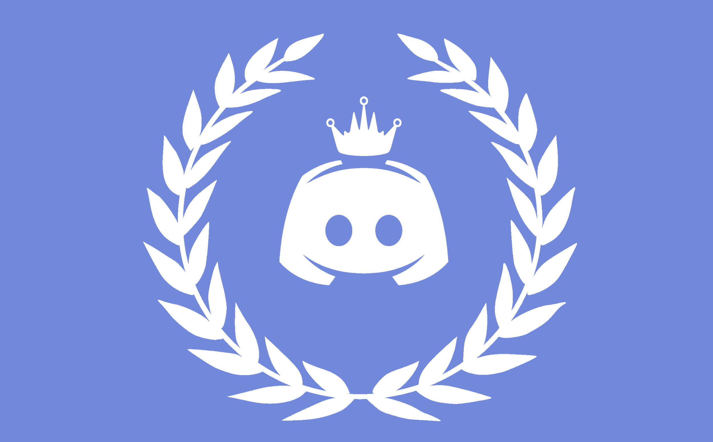

<h1 align="center">
Better Discord Themes

</h1>

<h2 align="center">A compilcation of better discord themes</h2>

&#160;&#160;&#160;&#160;

## How To Contribute

Click on these badges to see how you might be able to help:

&#160;&#160;&#160;&#160;

## Thanks to all Contributors 💪

- **Thank you** for considering to contribute
- Feel free to submit feature requests, UI updates, bugs as issues.
- Checkout [Contribution Guidelines](https://github.com/Vaporjawn/better-discord-themes/blob/master/CONTRIBUTING.md) for more information.
- Have a feature request? Feel free to create a issue for it.

Special thanks to [Project Gutenberg](https://www.gutenberg.org/) for providing free books.

## Your Support means a lot

Give a ⭐ to show support for the project.
